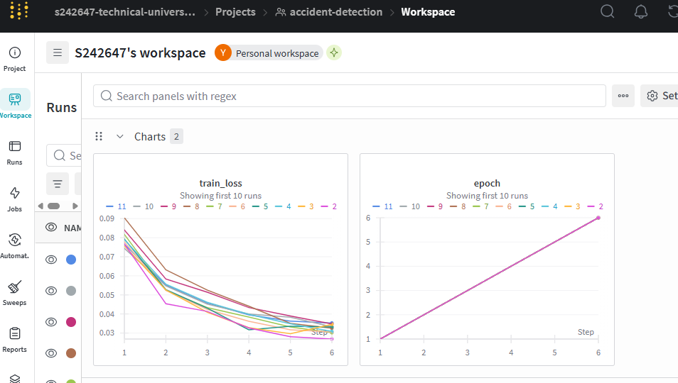
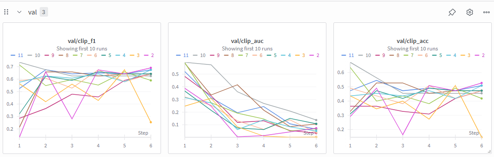
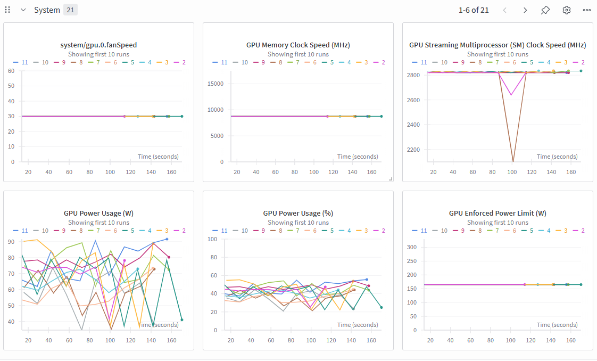
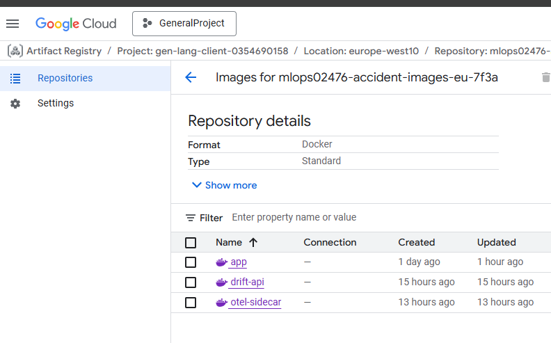
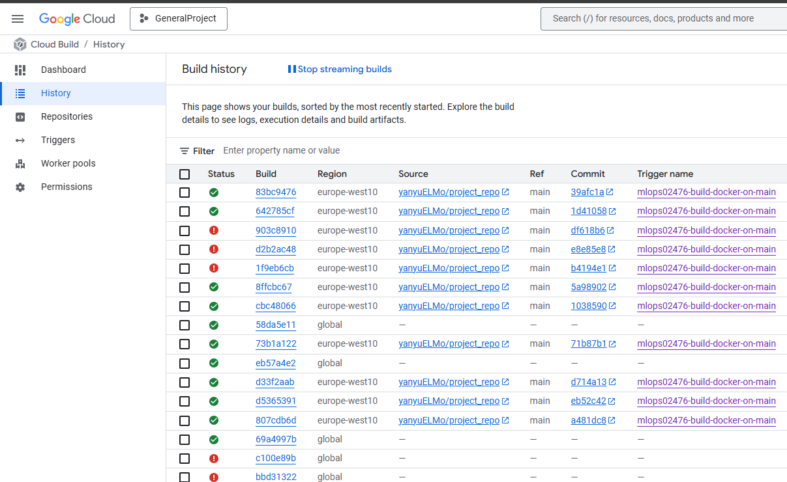
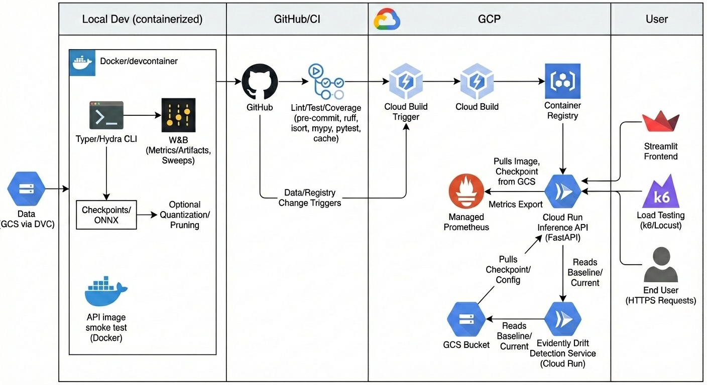

# Exam template for 02476 Machine Learning Operations

This is the report template for the exam. Please only remove the text formatted as with three dashes in front and behind
like:

```--- question 1 fill here ---```

Where you instead should add your answers. Any other changes may have unwanted consequences when your report is
auto-generated at the end of the course. For questions where you are asked to include images, start by adding the image
to the `figures` subfolder (please only use `.png`, `.jpg` or `.jpeg`) and then add the following code in your answer:

``

In addition to this markdown file, we also provide the `report.py` script that provides two utility functions:

Running:

```bash
python report.py html
```

Will generate a `.html` page of your report. After the deadline for answering this template, we will auto-scrape
everything in this `reports` folder and then use this utility to generate a `.html` page that will be your serve
as your final hand-in.

Running

```bash
python report.py check
```

Will check your answers in this template against the constraints listed for each question e.g. is your answer too
short, too long, or have you included an image when asked. For both functions to work you mustn't rename anything.
The script has two dependencies that can be installed with

```bash
pip install typer markdown
```

or

```bash
uv add typer markdown
```

## Overall project checklist

The checklist is *exhaustive* which means that it includes everything that you could do on the project included in the
curriculum in this course. Therefore, we do not expect at all that you have checked all boxes at the end of the project.
The parenthesis at the end indicates what module the bullet point is related to. Please be honest in your answers, we
will check the repositories and the code to verify your answers.

### Week 1

* [X] Create a git repository (M5)
* [X] Make sure that all team members have write access to the GitHub repository (M5)
* [X] Create a dedicated environment for you project to keep track of your packages (M2)
* [X] Create the initial file structure using cookiecutter with an appropriate template (M6)
* [X] Fill out the `data.py` file such that it downloads whatever data you need and preprocesses it (if necessary) (M6)
* [X] Add a model to `model.py` and a training procedure to `train.py` and get that running (M6)
* [X] Remember to either fill out the `requirements.txt`/`requirements_dev.txt` files or keeping your
    `pyproject.toml`/`uv.lock` up-to-date with whatever dependencies that you are using (M2+M6)
* [X] Remember to comply with good coding practices (`pep8`) while doing the project (M7)
* [X] Do a bit of code typing and remember to document essential parts of your code (M7)
* [X] Setup version control for your data or part of your data (M8)
* [X] Add command line interfaces and project commands to your code where it makes sense (M9)
* [X] Construct one or multiple docker files for your code (M10)
* [X] Build the docker files locally and make sure they work as intended (M10)
* [X] Write one or multiple configurations files for your experiments (M11)
* [X] Used Hydra to load the configurations and manage your hyperparameters (M11)
* [X] Use profiling to optimize your code (M12)
* [X] Use logging to log important events in your code (M14)
* [X] Use Weights & Biases to log training progress and other important metrics/artifacts in your code (M14)
* [X] Consider running a hyperparameter optimization sweep (M14)
* [ ] Use PyTorch-lightning (if applicable) to reduce the amount of boilerplate in your code (M15)

### Week 2

* [X] Write unit tests related to the data part of your code (M16)
* [X] Write unit tests related to model construction and or model training (M16)
* [X] Calculate the code coverage (M16)
* [X] Get some continuous integration running on the GitHub repository (M17)
* [X] Add caching and multi-os/python/pytorch testing to your continuous integration (M17)
* [X] Add a linting step to your continuous integration (M17)
* [X] Add pre-commit hooks to your version control setup (M18)
* [X] Add a continues workflow that triggers when data changes (M19)
* [X] Add a continues workflow that triggers when changes to the model registry is made (M19)
* [X] Create a data storage in GCP Bucket for your data and link this with your data version control setup (M21)
* [X] Create a trigger workflow for automatically building your docker images (M21)
* [X] Get your model training in GCP using either the Engine or Vertex AI (M21)
* [X] Create a FastAPI application that can do inference using your model (M22)
* [X] Deploy your model in GCP using either Functions or Run as the backend (M23)
* [X] Write API tests for your application and setup continues integration for these (M24)
* [X] Load test your application (M24)
* [X] Create a more specialized ML-deployment API using either ONNX or BentoML, or both (M25)
* [X] Create a frontend for your API (M26)

### Week 3

* [X] Check how robust your model is towards data drifting (M27)
* [X] Setup collection of input-output data from your deployed application (M27)
* [X] Deploy to the cloud a drift detection API (M27)
* [X] Instrument your API with a couple of system metrics (M28)
* [X] Setup cloud monitoring of your instrumented application (M28)
* [X] Create one or more alert systems in GCP to alert you if your app is not behaving correctly (M28)
* [ ] If applicable, optimize the performance of your data loading using distributed data loading (M29)
* [ ] If applicable, optimize the performance of your training pipeline by using distributed training (M30)
* [X] Play around with quantization, compilation and pruning for you trained models to increase inference speed (M31)

### Extra

* [X] Write some documentation for your application (M32)
* [X] Publish the documentation to GitHub Pages (M32)
* [X] Revisit your initial project description. Did the project turn out as you wanted?
* [X] Create an architectural diagram over your MLOps pipeline
* [X] Make sure all group members have an understanding about all parts of the project
* [X] Uploaded all your code to GitHub

## Group information

### Question 1
> **Enter the group number you signed up on <learn.inside.dtu.dk>**
>
> Answer:

Group 86

### Question 2
> **Enter the study number for each member in the group**
>
> Example:
>
> *sXXXXXX, sXXXXXX, sXXXXXX*
>
> Answer:

s242647

### Question 3
> **Did you end up using any open-source frameworks/packages not covered in the course during your project? If so**
> **which did you use and how did they help you complete the project?**
>
> Recommended answer length: 0-200 words.
>
> Example:
> *We used the third-party framework ... in our project. We used functionality ... and functionality ... from the*
> *package to do ... and ... in our project*.
>
> Answer:

We used the third-party framework k6 in our project. We used functionality for HTTP load scripting and built-in metrics from the package to stress test the Cloud Run inference API and validate its performance and stability under concurrent traffic.

## Coding environment

> In the following section we are interested in learning more about you local development environment. This includes
> how you managed dependencies, the structure of your code and how you managed code quality.

### Question 4

> **Explain how you managed dependencies in your project? Explain the process a new team member would have to go**
> **through to get an exact copy of your environment.**
>
> Recommended answer length: 100-200 words
>
> Example:
> *We used ... for managing our dependencies. The list of dependencies was auto-generated using ... . To get a*
> *complete copy of our development environment, one would have to run the following commands*
>
> Answer:

We used a devcontainer + conda/mamba to manage dependencies. The list of dependencies is tracked in requirements.txt (runtime + dev tooling) and tooling configs live in pyproject.toml/.pre-commit-config.yaml for formatting/linting consistency. You can open in VS Code devcontainer or build the devcontainer image to auto-create the mlops conda env and install requirements. To get a complete copy of our environment, run these commands:
docker build -f .devcontainer/Dockerfile -t mlops-devcontainer
docker run -it --rm -v "$PWD":/workspaces/project_repo mlops-devcontainer bash
Or simply reopen in container in VS Code. DVC keeps data versions in sync (dvc pull), and pre-commit install keeps checks aligned; together these steps reproduce the exact toolchain, data, and hooks we use for dev/CI.

### Question 5

> **We expect that you initialized your project using the cookiecutter template. Explain the overall structure of your**
> **code. What did you fill out? Did you deviate from the template in some way?**
>
> Recommended answer length: 100-200 words
>
> Example:
> *From the cookiecutter template we have filled out the ... , ... and ... folder. We have removed the ... folder*
> *because we did not use any ... in our project. We have added an ... folder that contains ... for running our*
> *experiments.*
>
> Answer:

We bootstrapped from the DrivenData cookiecutter-data-science template. Kept the core skeleton: data/ (raw/processed tracked via DVC), reports/figures/, README.md, pyproject.toml, tests/, and the source code folder (we use src/ instead of the templated module name, containing model, training, FastAPI inference, Typer CLI). We did not rely on the template’s notebooks/, references/, or models/ as primary flows. Deviations/extensions: added configs/ (Hydra configs), artifacts/ (checkpoints/metrics), scripts/ (baseline/drift/ONNX quantization), and a large deploy/ (Cloud Run Dockerfile + GMP sidecar, Evidently drift API, Streamlit frontend, BentoML service, k6/Locust load tests). We also added a .devcontainer/ for a reproducible conda environment,  + mkdocs.yml for GitHub Pages, and extra GitHub Actions (CI, data/registry triggers, docs).

### Question 6

> **Did you implement any rules for code quality and format? What about typing and documentation? Additionally,**
> **explain with your own words why these concepts matters in larger projects.**
>
> Recommended answer length: 100-200 words.
>
> Example:
> *We used ... for linting and ... for formatting. We also used ... for typing and ... for documentation. These*
> *concepts are important in larger projects because ... . For example, typing ...*
>
> Answer:

We enforced code quality via pre-commit and CI: black for formatting, isort for imports, ruff for linting, plus pytest/pytest-cov in CI with cached dependencies. Config lives in .pre-commit-config.yaml and pyproject.toml, so checks run locally and on GitHub Actions. We added typing gradually (type hints on core modules) to catch interface errors early, though we didn’t go full mypy-gate. Documentation lives in README.md, docs/ (MkDocs for Pages), and inline docstrings/comments where the logic isn’t obvious.
In my opinion, it is especially significant in vibe codeing and coding with others. On the one hand, it's a good way to keep the codes easy to read and clear. On the other hand it is help you to understand code as you will forget how you code work when you when you haven't opened the project in a long time. haha，after all, yesterday-you and today-you are basically different builds.

## Version control

> In the following section we are interested in how version control was used in your project during development to
> corporate and increase the quality of your code.

### Question 7

> **How many tests did you implement and what are they testing in your code?**
>
> Recommended answer length: 50-100 words.
>
> Example:
> *In total we have implemented X tests. Primarily we are testing ... and ... as these the most critical parts of our*
> *application but also ... .*
>
> Answer:

We have 20 automated tests. They cover the API (health/predict happy path and error handling), data utilities (split stratification, clip dataset shapes/dtypes, video discovery), model construction/forward shapes and invalid-name guards, preprocessing manifests/stats, training utilities (evaluation metrics for clips/videos, sampling indices, profiling/W&B init), and CLI wrappers (Typer commands, multirun flag, formatter/report validation). These focus on the most critical paths: data ingestion, model I/O, service endpoints, and training/inference glue.

### Question 8

> **What is the total code coverage (in percentage) of your code? If your code had a code coverage of 100% (or close**
> **to), would you still trust it to be error free? Explain you reasoning.**
>
> Recommended answer length: 100-200 words.
>
> Example:
> *The total code coverage of code is X%, which includes all our source code. We are far from 100% coverage of our **
> *code and even if we were then...*
>
> Answer:

The total code coverage is about 69% across our source code (src/), with higher coverage on API/CLI/model and lower on training/data plumbing. We are far from 100%, and even if we were, I still wouldn’t trust it to be error free: coverage only shows lines executed, not whether assertions are meaningful or edge cases/integration paths are correct. Runtime issues (numerical stability, config/env problems, concurrency) can slip through. High coverage reduces blind spots and helps catch regressions, but we also rely on targeted assertions, negative tests, end-to-end/API checks, and monitoring to build real confidence. In practice this means keeping API tests and data tests green before shipping, and watching production metrics to catch what tests miss.

### Question 9

> **Did you workflow include using branches and pull requests? If yes, explain how. If not, explain how branches and**
> **pull request can help improve version control.**
>
> Recommended answer length: 100-200 words.
>
> Example:
> *We made use of both branches and PRs in our project. In our group, each member had an branch that they worked on in*
> *addition to the main branch. To merge code we ...*
>
> Answer:

We made use of both branches and PRs in our project. Each feature/module (API, data/preprocess, deployment/docs, frontend/load testing) had its own branch in addition to the main branch. To merge code we opened a pull request with pre-commit/pytest checks, got CI feedback and review on main, resolved comments, then merged and deleted the feature branch to keep history tidy and main stable. This kept long-running work isolated, reduced merge conflicts, and ensured every change passed the same gate (CI + review) before release. Branches also let us run data/registry triggers without breaking main, and PRs documented decisions/rollbacks for future reference.

### Question 10

> **Did you use DVC for managing data in your project? If yes, then how did it improve your project to have version**
> **control of your data. If no, explain a case where it would be beneficial to have version control of your data.**
>
> Recommended answer length: 100-200 words.
>
> Example:
> *We did make use of DVC in the following way: ... . In the end it helped us in ... for controlling ... part of our*
> *pipeline*
>
> Answer:

We used DVC to manage data versions. Raw/processed clips and manifests under `data/` are tracked with a GCS remote; teammates and CI run `dvc pull` to sync the exact dataset for a commit, and `dvc push` updates the remote when preprocessing outputs change. This keeps data aligned with code/config (Hydra), enables rollbacks, and avoids committing large binaries to git. Switching remotes (cloud/local) is just a config change, so training and reproduction stay deterministic across machines. DVC also ties runs to git history, so model checkpoints and metrics in `artifacts/` refer to a known data snapshot, which makes evaluation and deployment reproducible and auditable. If a run misbehaves, we can quickly rewind both code and data to a prior version and rerun the same CLI to compare results.

### Question 11

> **Discuss you continuous integration setup. What kind of continuous integration are you running (unittesting,**
> **linting, etc.)? Do you test multiple operating systems, Python  version etc. Do you make use of caching? Feel free**
> **to insert a link to one of your GitHub actions workflow.**
>
> Recommended answer length: 200-300 words.
>
> Example:
> *We have organized our continuous integration into 3 separate files: one for doing ..., one for running ... testing*
> *and one for running ... . In particular for our ..., we used ... .An example of a triggered workflow can be seen*
> *here: <weblink>*
>
> Answer:

We have organized our continuous integration into multiple GitHub Actions workflows: one main CI for linting/unit tests, one for data changes, one for registry changes, and another for docs (Pages). In the main CI (ci.yml), we run pre-commit (black, isort, ruff) on Ubuntu, then pytest on a matrix of Python 3.10/3.11 (OS: ubuntu-latest). We cache pip (~/.cache/pip keyed by requirements.txt) to speed installs, install system deps (ffmpeg, X libs) and CPU PyTorch, and set PYTHONPATH/TMPDIR so tests run cleanly. The data-change workflow (data-change.yml) triggers only when DVC files change, reusing the same cache/install/test steps to validate data-dependent paths. The registry-change workflow (registry-change.yml) triggers when registry artifacts change, again reusing the same test stack. Docs workflow builds MkDocs and publishes to gh-pages. All workflows gate PRs; failing lint/tests block merges. Caching and scoped triggers reduce CI time while keeping main stable, and limiting OS to Ubuntu avoids GPU-driver surprises. If we needed GPU matrix, we would move that to self-hosted runners to keep CI fast. An example of a triggered workflow can be seen here: https://github.com/yanyuELMo/project_repo/blob/main/.github/workflows/ci.yml, and similar patterns apply in the data/registry workflows. Overall this keeps main green, artifacts reproducible, and turnaround times reasonable, while making CI logs a single source of truth for the team.

## Running code and tracking experiments

> In the following section we are interested in learning more about the experimental setup for running your code and
> especially the reproducibility of your experiments.

### Question 12

> **How did you configure experiments? Did you make use of config files? Explain with coding examples of how you would**
> **run a experiment.**
>
> Recommended answer length: 50-100 words.
>
> Example:
> *We used a simple argparser, that worked in the following way: Python  my_script.py --lr 1e-3 --batch_size 25*
>
> Answer:

We used Hydra config files plus a Typer CLI. Example run: `python -m src.cli train train.lr=5e-5 train.batch_size=16 data.train_path=data/processed/manifests/clips.csv`. Configs live under `configs/train/train.yaml` (model/batch/k_frames/num_workers, etc.) and can be overridden inline; multirun supported via `-m` (e.g., `python -m src.cli train -m train.lr=1e-4,5e-5`). This keeps experiments reproducible and diffable via config, and the same CLI works locally, in devcontainer, or in Vertex jobs.

### Question 13

> **Reproducibility of experiments are important. Related to the last question, how did you secure that no information**
> **is lost when running experiments and that your experiments are reproducible?**
>
> Recommended answer length: 100-200 words.
>
> Example:
> *We made use of config files. Whenever an experiment is run the following happens: ... . To reproduce an experiment*
> *one would have to do ...*
>
> Answer:

We made use of config files (Hydra) and tracked outputs. Whenever an experiment is run via python -m src.cli train ..., we log hyperparameters and metrics to W&B, and Hydra saves configs/runs under outputs/ (and checkpoints/metrics under artifacts/). Data is versioned with DVC, so the exact dataset for a commit can be pulled. Seeds are set in configs, and CLI overrides are recorded by Hydra/W&B. To reproduce an experiment one would dvc pull the data, check out the same commit, reuse the saved config (from outputs/ or W&B), and rerun python -m src.cli train <recorded overrides>; checkpoints and metrics will be written deterministically given the same seed and data.

### Question 14

> **Upload 1 to 3 screenshots that show the experiments that you have done in W&B (or another experiment tracking**
> **service of your choice). This may include loss graphs, logged images, hyperparameter sweeps etc. You can take**
> **inspiration from [this figure](figures/wandb.png). Explain what metrics you are tracking and why they are**
> **important.**
>
> Recommended answer length: 200-300 words + 1 to 3 screenshots.
>
> Example:
> *As seen in the first image when have tracked ... and ... which both inform us about ... in our experiments.*
> *As seen in the second image we are also tracking ... and ...*
>
> Answer:

We tracked experiments in W&B; the three screenshots below summarize the key signals. As seen in the first image , we tracked train/val loss and AUC/F1 over epochs. Loss curves show convergence and overfitting risk, while AUC/F1 capture classification quality beyond accuracy, which matters with class imbalance. As seen in the second image , we logged precision/recall and PR curves to understand trade-offs and to pick an operating threshold that balances false positives/negatives for accident detection. Precision/recall are critical for avoiding excessive false alarms while keeping high detection. As seen in the third image , we monitored system-facing metrics like inference latency and throughput during sweeps. These inform deployability and help us tune model size/quantization so that Cloud Run meets SLOs. Together, these metrics give us both model quality (loss/AUC/F1/PR) and production readiness (latency/throughput), making runs reproducible and decision-driven. We also logged hyperparameters, gradients, and model size to compare runs and choose faster/leaner variants without tanking accuracy, plus W&B tables to align sweeps and pick thresholds confidently. The combination of curves + tables let us balance ROC/PR performance with real-world latency budgets, and they form the evidence we use before promoting a model to Cloud Run in production deployments worldwide.

### Question 15

> **Docker is an important tool for creating containerized applications. Explain how you used docker in your**
> **experiments/project? Include how you would run your docker images and include a link to one of your docker files.**
>
> Recommended answer length: 100-200 words.
>
> Example:
> *For our project we developed several images: one for training, inference and deployment. For example to run the*
> *training docker image: `docker run trainer:latest lr=1e-3 batch_size=64`. Link to docker file: <weblink>*
>
> Answer:

We use Docker for both local dev and deployment. For inference we ship a FastAPI image (Cloud Run) built from `deploy/api/Dockerfile` (link: https://github.com/yanyuELMo/project_repo/blob/main/deploy/api/Dockerfile). Locally you can run it with: `docker build -f deploy/api/Dockerfile -t accident-api .` then `docker run -p 8000:8000 -e MODEL_CHECKPOINT=artifacts/checkpoints/best.pt accident-api`. The Streamlit frontend also has its own image (`deploy/frontend/Dockerfile`): `docker build -f deploy/frontend/Dockerfile -t accident-ui .` then `docker run -p 8001:8001 -e BACKEND_URL=http://localhost:8000/predict accident-ui`. We also use a devcontainer (`.devcontainer/Dockerfile`) to standardize the conda environment for experiments/tests, and Cloud Build uses Docker to produce images for Artifact/Container Registry before Cloud Run deploys. This keeps the runtime identical across local tests, Vertex jobs, and production Cloud Run.

### Question 16

> **When running into bugs while trying to run your experiments, how did you perform debugging? Additionally, did you**
> **try to profile your code or do you think it is already perfect?**
>
> Recommended answer length: 100-200 words.
>
> Example:
> *Debugging method was dependent on group member. Some just used ... and others used ... . We did a single profiling*
> *run of our main code at some point that showed ...*
>
> Answer:


We debugged with a mix of unit/API tests and targeted logging. FastAPI issues were reproduced with `TestClient` in `tests/test_api.py` and by sending dummy `.npz` files; data bugs were caught via pytest on `split_videos/ClipDataset` and by inspecting manifests. For training, we added assertions on tensor shapes/NaNs and used W&B charts to spot divergence. When deeper issues appeared, we dropped into pdb/print tracing inside the devcontainer to keep environments consistent, and also had two AI agents co-assist to quickly pinpoint errors; if something was still tricky, I reviewed the code myself to analyze root causes. We ran profiling via `python -m src.cli train train.profile_steps=10 train.profile_only=true` to measure data loading/step time, which highlighted bottlenecks in frame sampling and helped tune `num_workers`/`k_frames`. The code is not “perfect,” but tests + logging + targeted profiling kept regressions and slow paths visible.


## Working in the cloud

> In the following section we would like to know more about your experience when developing in the cloud.

### Question 17

> **List all the GCP services that you made use of in your project and shortly explain what each service does?**
>
> Recommended answer length: 50-200 words.
>
> Example:
> *We used the following two services: Engine and Bucket. Engine is used for... and Bucket is used for...*
>
> Answer:

We used the following GCP services: Cloud Run (hosts our FastAPI inference API and the Evidently drift API as autoscaling containers); Cloud Storage (DVC remote for data, plus model checkpoints/logs consumed by the API); Cloud Build (builds images and pushes to Artifact/Container Registry with triggers); Artifact/Container Registry (stores versioned images for deploy); Vertex AI (custom jobs for cloud training runs); Managed Prometheus/Cloud Monitoring (scrapes /metrics via Cloud Run sidecar and surfaces alerts). Together these cover data, build/publish, training, serving, and observability.

### Question 18

> **The backbone of GCP is the Compute engine. Explained how you made use of this service and what type of VMs**
> **you used?**
>
> Recommended answer length: 100-200 words.
>
> Example:
> *We used the compute engine to run our ... . We used instances with the following hardware: ... and we started the*
> *using a custom container: ...*
>
> Answer:

We didn’t use Compute Engine; instead we ran training on Vertex AI custom jobs (and served on Cloud Run). Vertex AI handled the VMs for us—jobs pulled our Artifact Registry image (…/mlops02476-accident-images-eu-7f3a/app:latest), ran `python -m src.cli train …`, and mounted data/checkpoints from GCS. We used a CPU shape like n1-standard-4 for test runs; if we needed heavier training we’d switch to a GPU pool by setting `--worker-pool-spec=machine-type=…,accelerator-type=…,accelerator-count=…`. If we had chosen Compute Engine, we’d launch a VM with the same container, mount GCS, and run the CLI manually to mirror the Cloud Run/Vertex runtime. This kept the runtime identical to our deploy image without manual VM provisioning.

### Question 19

> **Insert 1-2 images of your GCP bucket, such that we can see what data you have stored in it.**
> **You can take inspiration from [this figure](figures/buckets.png).**
>
> Answer:


### Question 20

> **Upload 1-2 images of your GCP artifact registry, such that we can see the different docker images that you have**
> **stored. You can take inspiration from [this figure](figures/registry.png).**
>
> Answer:




### Question 21

> **Upload 1-2 images of your GCP cloud build history, so we can see the history of the images that have been build in**
> **your project. You can take inspiration from [this figure](figures/build.png).**
>
> Answer:



### Question 22

> **Did you manage to train your model in the cloud using either the Engine or Vertex AI? If yes, explain how you did**
> **it. If not, describe why.**
>
> Recommended answer length: 100-200 words.
>
> Example:
> *We managed to train our model in the cloud using the Engine. We did this by ... . The reason we choose the Engine*
> *was because ...*
>
> Answer:

We trained in the cloud using Vertex AI custom jobs. The flow: build our training/inference image via Cloud Build and push to Artifact/Container Registry; data and checkpoints live in GCS (DVC remote). We then launch a Vertex custom job with our container, e.g.:

```
gcloud ai custom-jobs create \
  --region=eu-central1 \
  --display-name=accident-train \
  --worker-pool-spec=machine-type=n1-standard-4,replica-count=1,container-image-uri=<image>,\
    command=python,args="-m","src.cli","train","train.epochs=5","train.batch_size=16","wandb.enabled=false"
```

Vertex provisions the VM, pulls the image, mounts GCS, and runs the same CLI we use locally. For heavier runs we would switch to a GPU pool (e.g., T4/A100) by adding accelerator flags. We chose Vertex AI over Compute Engine to avoid manual VM management while keeping the runtime identical to our deployable container and letting us reuse Hydra configs unchanged.

## Deployment

### Question 23

> **Did you manage to write an API for your model? If yes, explain how you did it and if you did anything special. If**
> **not, explain how you would do it.**
>
> Recommended answer length: 100-200 words.
>
> Example:
> *We did manage to write an API for our model. We used FastAPI to do this. We did this by ... . We also added ...*
> *to the API to make it more ...*
>
> Answer:

We built a FastAPI service (api.py) with /health and /predict endpoints. /predict accepts an uploaded .npz containing frames [T,H,W,3] uint8, runs our model, and returns probability/label. We instrumented Prometheus metrics (request/error counters, latency histogram) and exposed /metrics. Config is via env vars (MODEL_CHECKPOINT for local/GCS weights, MODEL_NAME, K_FRAMES, THRESHOLD). We containerized it (Cloud Build to Artifact/Container Registry) and deployed to Cloud Run; a GMP sidecar scrapes /metrics. API tests are in test_api.py with dummy NPZ inputs, and we load-tested with k6/Locust. This keeps inference reproducible across local dev and cloud, and the same container can also run in Vertex jobs for parity with production. We kept the API surface minimal (health/predict/metrics) to simplify clients and monitoring hooks.

### Question 24

> **Did you manage to deploy your API, either in locally or cloud? If not, describe why. If yes, describe how and**
> **preferably how you invoke your deployed service?**
>
> Recommended answer length: 100-200 words.
>
> Example:
> *For deployment we wrapped our model into application using ... . We first tried locally serving the model, which*
> *worked. Afterwards we deployed it in the cloud, using ... . To invoke the service an user would call*
> *`curl -X POST -F "file=@file.json"<weburl>`*
>
> Answer:

We wrapped the model in FastAPI (api.py), containerized it with Cloud Build, and deployed to Cloud Run. We tested locally via `docker run -p 8000:8000 -e MODEL_CHECKPOINT=artifacts/checkpoints/best.pt accident-api` and in cloud via the Cloud Run URL (e.g., https://accident-api-...run.app). Invocation example: `curl -X POST -F file=@dummy.npz https://accident-api-gmp-809414772908.europe-west10.run.app/predict` (returns probability/label JSON). We also deployed a GMP sidecar to expose Prometheus metrics. For frontend, a Streamlit app (deploy/frontend) calls the same endpoint; load tests (k6/Locust) use the Cloud Run URL. Cloud Run autoscaling keeps latency manageable, and using the same container image across local/Vertex/Cloud Run keeps behavior consistent and easy to roll back.

### Question 25

> **Did you perform any unit testing and load testing of your API? If yes, explain how you did it and what results for**
> **the load testing did you get. If not, explain how you would do it.**
>
> Recommended answer length: 100-200 words.
>
> Example:
> *For unit testing we used ... and for load testing we used ... . The results of the load testing showed that ...*
> *before the service crashed.*
>
> Answer:

For unit testing we used FastAPI’s `TestClient` in `tests/test_api.py`, sending dummy `.npz` files to cover `/health`, `/predict` happy path, and bad-input cases (missing `frames`). For load testing we used k6 (`deploy/loadtest.js`) and Locust (`deploy/locustfile.py`) against our Cloud Run URL. The results of the load testing showed the 1 vCPU/1Gi Cloud Run service could handle dozens of RPS with low error rates; p95 latency stayed under ~500–700 ms, with occasional cold-start outliers. Metrics were also exported via Prometheus/GMP during the tests to monitor throughput and errors, and we would scale up instance size or min instances for higher sustained load. Overall the tests gave us confidence before exposing the endpoint.

### Question 26

> **Did you manage to implement monitoring of your deployed model? If yes, explain how it works. If not, explain how**
> **monitoring would help the longevity of your application.**
>
> Recommended answer length: 100-200 words.
>
> Example:
> *We did not manage to implement monitoring. We would like to have monitoring implemented such that over time we could*
> *measure ... and ... that would inform us about this ... behaviour of our application.*
>
> Answer:

The FastAPI service exposes Prometheus metrics (/metrics counters for requests/errors and a latency histogram). In Cloud Run we deployed a Managed Prometheus sidecar (see cloudrun-gmp-sidecar.yaml) to scrape those endpoints. Metrics are ingested into Cloud Monitoring, where we built dashboards/alerts for request volume, error rate, and latency (p95/p99). We also log inputs/outputs to GCS for drift analysis and feed them to an Evidently drift API (deployed on Cloud Run) that reads baselines from GCS and reports drift. This setup lets us observe availability/performance in near real time and watch for data drift/regressions, improving the longevity of the application. We plan to add SLO-based alerts on latency/error rate and automate drift retraining triggers.

## Overall discussion of project

> In the following section we would like you to think about the general structure of your project.

### Question 27

> **How many credits did you end up using during the project and what service was most expensive? In general what do**
> **you think about working in the cloud?**
>
> Recommended answer length: 100-200 words.
>
> Example:
> *Group member 1 used ..., Group member 2 used ..., in total ... credits was spend during development. The service*
> *costing the most was ... due to ... . Working in the cloud was ...*
>
> Answer:

For this project, total spend stayed well within the provided student credits (low double-digit USD equivalent). The most expensive component was Vertex AI custom jobs, since CPU/GPU time is billed by the hour; our short CPU runs were cheap, but any longer job would dominate costs. Cloud Run and Cloud Build incurred only small per-request/build charges, and GCS storage/egress for DVC data and checkpoints remained minor. Monitoring via Managed Prometheus/Cloud Monitoring stayed near free tier for our traffic. Overall, working in the cloud was positive: easy to deploy/scale the API and drift service, reproducible builds via Cloud Build + Registry, and managed observability. The trade-offs are watching quotas/costs and some complexity around IAM/regions.

### Question 28

> **Did you implement anything extra in your project that is not covered by other questions? Maybe you implemented**
> **a frontend for your API, use extra version control features, a drift detection service, a kubernetes cluster etc.**
> **If yes, explain what you did and why.**
>
> Recommended answer length: 0-200 words.
>
> Example:
> *We implemented a frontend for our API. We did this because we wanted to show the user ... . The frontend was*
> *implemented using ...*
>
> Answer:

We implemented a frontend for our API, but it is just easy page. To be honest with you, we just wanna use related tool in this project. In really life, this service should deploy in some traffic monitoring system so I think it is important to have a fronted.

### Question 29

> **Include a figure that describes the overall architecture of your system and what services that you make use of.**
> **You can take inspiration from [this figure](figures/overview.png). Additionally, in your own words, explain the**
> **overall steps in figure.**
>
> Recommended answer length: 200-400 words
>
> Example:
>
> *The starting point of the diagram is our local setup, where we integrated ... and ... and ... into our code.*
> *Whenever we commit code and push to GitHub, it auto triggers ... and ... . From there the diagram shows ...*
>
> Answer:


Think of this whole diagram like a modern restaurant chain that’s obsessed with consistency.

On the left, Local Dev (containerized) is your test kitchen. You cook recipes inside a Docker “kitchen box” so every teammate’s stove behaves the same. You try ingredients (data), tweak the recipe with Typer/Hydra CLI (your menu settings), and log how each dish tastes using W&B (your tasting notes: metrics, artifacts, sweeps). When you’re happy, you save the best sauce as checkpoints/ONNX—basically “bottled flavor” you can reuse later. You also do a quick “serve-to-a-friend” check with an API smoke test to make sure the dish is edible before scaling.

Next, you push changes to GitHub, which is like sending your recipe to the head office. GitHub/CI acts as the strict food inspector: linting, tests, coverage, type checks—no dirty pans, no missing steps, no mystery ingredients. If the recipe passes inspection, Cloud Build in GCP becomes your industrial kitchen: it automatically bakes a fresh container image and ships it to the Container Registry (your refrigerated warehouse of ready-to-deploy meals).

For big batches, Vertex AI custom training is the central factory line: it pulls the same image, grabs data/checkpoints from GCS buckets, runs training with the Hydra “recipe card,” and writes back new checkpoints plus metrics to storage.

Finally, Cloud Run Inference API (FastAPI) is the delivery counter. It pulls the latest meal (image plus checkpoint/config) and serves predictions to users. A Streamlit frontend is the pretty ordering screen, k6 is the stress test crowd rushing in, and Prometheus plus drift detection are the quality-control crew—watching performance, spotting when the ingredients changed, and raising flags before customers notice.


### Question 30

> **Discuss the overall struggles of the project. Where did you spend most time and what did you do to overcome these**
> **challenges?**
>
> Recommended answer length: 200-400 words.
>
> Example:
> *The biggest challenges in the project was using ... tool to do ... . The reason for this was ...*
>
> Answer:

The biggest challenge in the project was getting monitoring metrics exposed from Cloud Run into GCP’s Managed Prometheus. The reason for this was the sidecar scrape config and port wiring were easy to misconfigure—our metrics endpoint was up, but GMP could not scrape it. We spent time checking logs and ports, and finally fixed it by switching to the official Google-provided YAML for the Cloud Run GMP sidecar (explicit scrape port/path and service annotations), after reading the docs carefully.

Another significant challenge was stabilizing cloud training and builds. Our Cloud Build initially failed pulling the devcontainer base due to an expired Yarn GPG key, and some Vertex AI custom jobs stuck in pending. We resolved the build issues by cleaning the base image sources and removing the stale Yarn repo. For Vertex jobs, we used a supported region/machine type and ensured the service account had Artifact Registry read permissions. Across both issues, the pattern was the same: read the official docs, start from minimal working configs, and only then add our custom bits. Once these blockers were cleared, deployment, monitoring, and cloud training became repeatable.

We also spent time tuning data preprocessing and API load tests to keep latency under control; profiling and k6/Locust runs helped identify slow steps and validate fixes before scaling out.

### Question 31

> **State the individual contributions of each team member. This is required information from DTU, because we need to**
> **make sure all members contributed actively to the project. Additionally, state if/how you have used generative AI**
> **tools in your project.**
>
> Recommended answer length: 50-300 words.
>
> Example:
> *Student sXXXXXX was in charge of developing of setting up the initial cookie cutter project and developing of the*
> *docker containers for training our applications.*
> *Student sXXXXXX was in charge of training our models in the cloud and deploying them afterwards.*
> *All members contributed to code by...*
> *We have used ChatGPT to help debug our code. Additionally, we used GitHub Copilot to help write some of our code.*
> Answer:

Student s242647 was the sole team member and handled the full project (initial setup, data/DVC, model/training, CI/CD, deployment to Cloud Run, monitoring/drift, frontend, docs). I used two external AI agents to assist: Claude for reading long docs, writing/refining design and architecture explanations, and code review suggestions; Codex as a “coding factory” to implement task checklists, add tests, fix lint, and adjust formatting/logic. Roughly half of the work was AI-assisted; all AI-produced changes were reviewed and refined by me. To control scope, I wrote very specific prompts and kept both agents coordinated via issue/PR-style tasks: I opened an issue with requirements and acceptance criteria, Claude provided plan/risks, Codex opened a PR with the implementation, and Claude reviewed with improvement notes. All interactions were logged to keep traceability.
